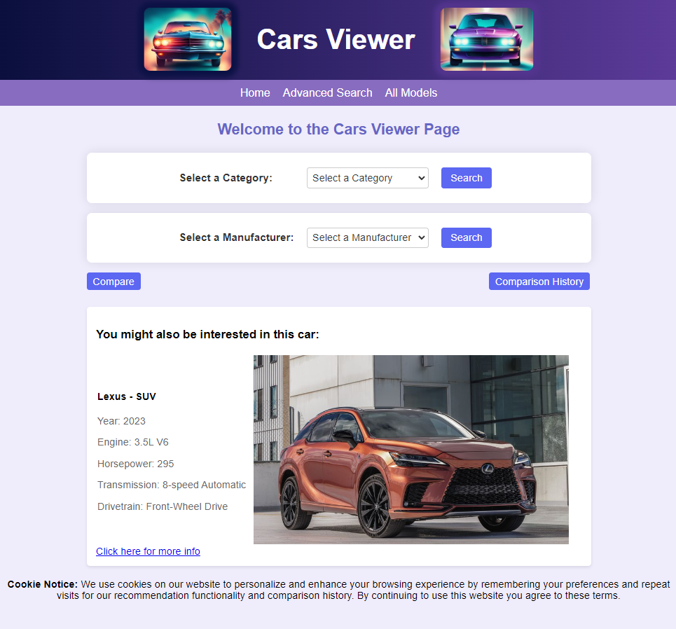

# CARS VIEWER
 
- Team: Henna Venho and Mikko Venäläinen 
- 3rd task at kood/Sisu (May 2024)


## Introduction

**Cars Viewer** is a versatile program that showcases information about different car models, their specifications, manufacturers, and more. The data is fetched from the included JS API and is displayed in a user friendly web interface.


## Technologies Used: 

- Golang Standard Library
- JSON 
- External Data Source (API)
- HTML
- CSS
- Canva for Banner Image Creation
- favicon.io for Favicon Generation from Image
- Visual Studio Code
- WSL (Ubuntu)
- Version Control System (Git)
- Repository (Gitea)
- Gitea Projects for Task Management
- VCS Client (Bash)
- Several Browsers for Testing


## Features

* Home page with manufacturer and category selection and comparison function. Also featured is a recommendation based on user preferences of manufacturer, or random recommendation if no cookie data is available.
* The comparison functionality is able to display car data in a data table for as many cars as the user wishes.
* The user can also view their own comparison history from the home page or the comparison page, and view any of the comparisons again.
* All Models displays all car data in the API.
* Advanced Search offers the options to search for any cars using AND/OR logic.

> AND: All the search terms match a single car model. \
> OR: Any search term matches any available car model. 


## Building and running the web server and API

The program is run as a web server.

### Build instructions for web server

Clone the repository to your computer:

> $ git clone https://github.com/HennaVenho/cars.git

Change directory to the cloned repository:

> $ cd cars

Build the executable program (optional):

> $ go build

### Build instructions for the API

The API package has already been downloaded but if you haven't done so already, you need to install NodeJS and required packages. These need to be only done once.

**Install NodeJS:** \
Either use your distribution's package manager or if you use Homebrew run the following command

> $ brew install node

**Install required packages:** \
If you are in the cars directory run the following commands

> $ cd api

> $ make build

### Running the server

You can run the program with `go run .`, or `./cars` if you built it.

**Optional arguments:**

You can see all of the optional arguments with `go run . -h`

If you don't use any optional arguments, the program will run asynchronously and without the simulated API delay. 

You can see the time it took to fetch all the model data in the terminal by viewing the All Models page. 

To compare the fetching time between concurrent and sequential handling, run the server first with only the `-d` flag, and then with both the `-d` and `-s` flags, and refresh the All Models page. 

```
$ go run . -h
Cars usage:
go run . [-h] [-d] [-s]

Optional arguments:
-h	Show usage help
-d	Use a simulated API delay (1 second) when getting data
-s	Use sequential data access instead of concurrent (All Models page)

```


**Example:**

Here is a visual of the web interface in action:




This is the end of the README file.