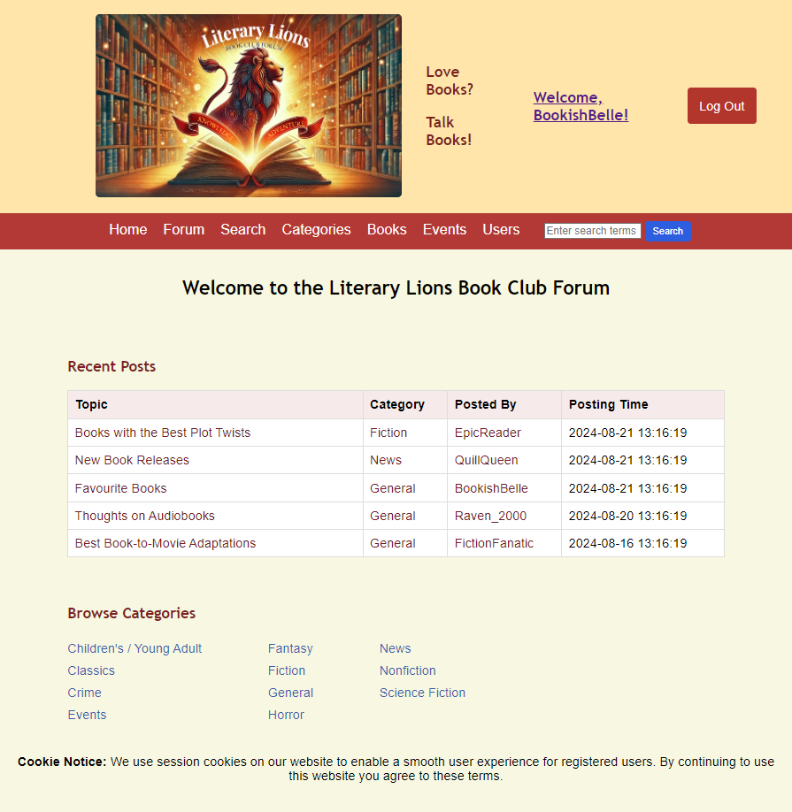

# LITERARY-LIONS

- Team: Henna Venho and Mikko Venäläinen 
- 5th task at kood/Sisu (August 2024)

## Introduction

**Literary-Lions** is a book-club web forum that allows users to communicate, associate categories with posts, create events, like/dislike posts, comments and events, filter posts, and search for posts, comments, or users.

## Technologies Used: 

- Golang Standard Library
- Encryption by Bcrypt: golang.org/x/crypto/bcrypt
- SQLite Database
- Go-sqlite3 Driver to Interface with SQLite: github.com/mattn/go-sqlite3
- Docker Engine and Docker Desktop for Containerizing
- Makefile
- Entity Relationship Diagram (ERD) Using drawDB: https://www.drawdb.app/editor
- HTML
- CSS
- DALL-E and Canva for Banner Image Creation
- favicon.io for Favicon Generation from Image
- Visual Studio Code
- WSL (Ubuntu)
- Version Control System (Git)
- Repository (Gitea)
- Gitea Projects for Task Management
- VCS Client (Bash)
- Several Browsers for Testing

## Tool Functionality

* Unregistered users can view posts and comments as well as events, categories, books and users, and they can make searches for topics, content, comments or users.
* Users can register using the Sign Up form, and log in using the Sign In form.
* Logged-in users can create posts, events and comments, and like or dislike them. They are also able to edit their own posts, events and comments, or change or delete their own likes and dislikes.
* Logged-in users also have access to their own profile page, where they can update their profile picture, motto and recommendations, which are shown to all users, or view their own created posts and liked posts, which are only shown to the logged-in user themselves. Logged-in users can also change their password, or delete their user account, along with all their posts, comments and likes, from their private profile page.

## Requirements

You need to install either Docker Engine or Docker Desktop:

> https://docs.docker.com/engine/install/

> https://docs.docker.com/desktop/

## Dockerfile

The program is built using a Dockerfile. Building the program builds a Docker image, and running it runs a container built from that image. Please see the commands below, or alternatively you can also use the Docker Desktop GUI to run the container after you have built it. 

## Building the Program

Clone the repository to your computer:

> $ git clone https://github.com/HennaVenho/literary-lions.git

Change directory to the cloned repository:

> $ cd literary-lions

While Docker is open, build the program using the default Dockername lionshennamikko and the default port 56789: 

> $ make build 

Alternatively you can build it by naming it and choosing the port yourself, but please remember that in that case you must also specify the name and the port in the build, run, stop and cleanup commands, e.g.: 

> $ make build DOCKERNAME=anyname PORT=60000

By default, the Makefile will create a volume for the database. If you want to, you can mount a local directory instead (by default: forumdatabasedirfordocker, but you can change that). 

> $ make build DOCKERMOUNT=directory

## Running the Program

Run the program: 

> $ make run

And go to the path in your browser - by default: http://localhost:56789/

**Optional Arguments:**

You can reset the database to default values with: 

> $ make reset

To display usage (for running with Go): 

> $ make help

## Stopping the Program, and Cleaning Up

Stop the program: 

> $ make stop

If you want to cleanup/delete our Docker stuff:

> $ make cleanup

This command will remove the specific Docker container, image and the volume from your system. However, it will retain, for example, the Go base image. You can prune or delete those manually, if you like, but we didn't want to do it automatically. If you use the directory mount, the cleanup will leave the database file still in its directory, so if you want to remove it as well, you can use: 

> $ rm -r forumdatabasedirfordocker

## Example:

Here is a visual of the web forum in action:

This is the end of the README file.