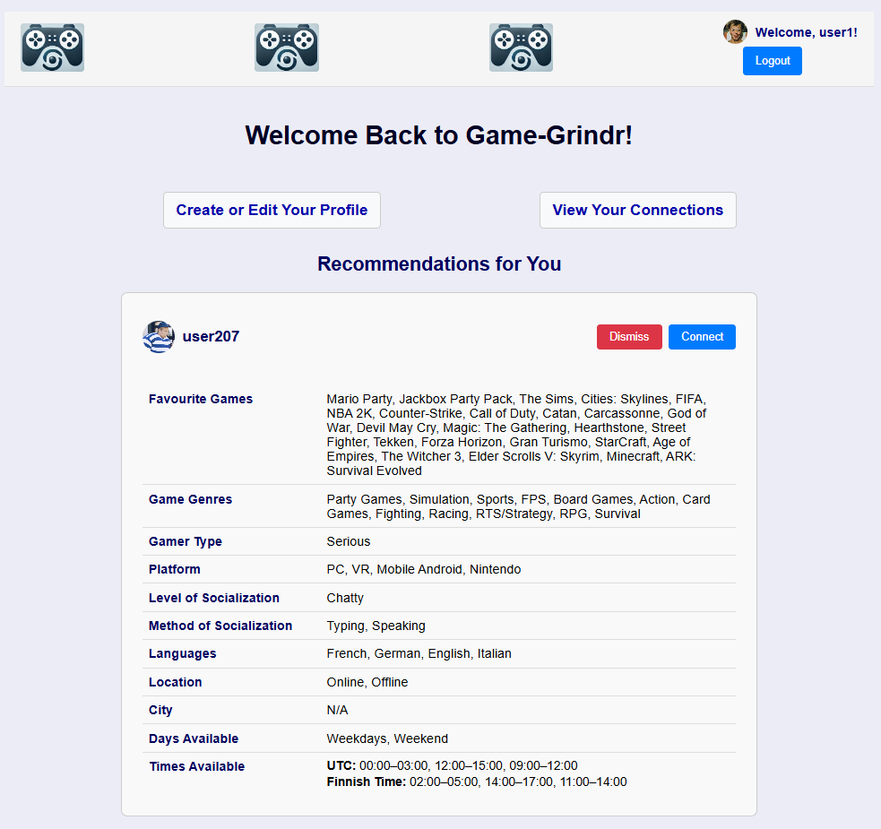
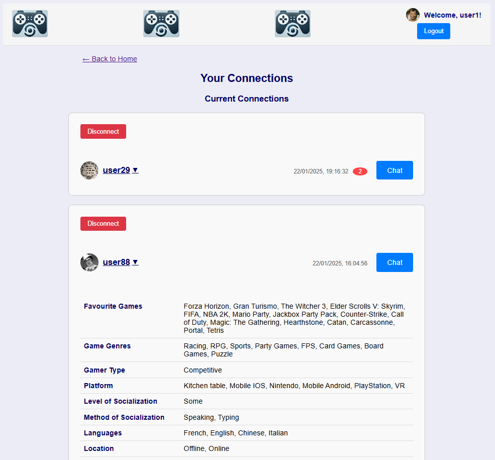

# MATCH-ME: Game-Grindr

- Team: Henna Venho and Mikko Venäläinen

## Introduction

**Match-Me: Game-Grindr** is a full-stack web application, which uses a recommendation algorithm to match users based on their gaming interests and preferences - whether it be online or offline. After the user has filled in their profile, the application will recommend other gamers who share similar preferences, and they can connect, and chat in real-time!

## Technologies Used

- Backend: 
    - Go Standard Library
    - JWT Authentication: "github.com/golang-jwt/jwt/v5"
    - Encryption by Bcrypt: "golang.org/x/crypto/bcrypt"
    - PostgreSQL Database Driver: "github.com/jackc/pgx/v5"
    - Concurrency-Safe Connection Pool for pgx: "github.com/jackc/pgx/v5/pgxpool"
    - Socket.IO for Real-Time Functionalities: "github.com/googollee/go-socket.io"
    - Bash for Database Environment Variable Configuration
- Frontend: 
    - React
    - Vite and vitejs/plugin-react
    - Socket.io-client for Real-Time Functionalities
    - HTML
    - CSS
    - ChatGPT Image Generator for Logo Creation
- Database: 
    - PostgreSQL
- Visual Studio Code
- Linux Mint and WSL (Ubuntu)
- Version Control System (Git)
- Repository (Gitea)
- Gitea Projects for Task Management
- VCS Client (Bash)
- Several Browsers for Testing

## Program Functionality

The user can register and sign in, after which they are directed to fill in their profile. The profile consists mostly of biographical data points, which are used to create recommendations of other users with similar interests, e.g. location, availability, and gaming genres and platforms. The user can also upload a profile picture, which is displayed for recommendations and connections, as well as list their favourite games for flavour in their profile. 

When biographical data points between two users score highly enough, they will be recommended as a match, and they are able to connect, and chat in real-time. If two users' interests are too dissimilar, e.g. they want to play offline in different cities, or using different platforms, they will not be recommended to each other. 

Recommendations can also be dismissed, in which case they will not be shown again, and the user is also able to disconnect with a made connection, if they so choose. The user can only see other users' profiles when they are recommended to them, they have received a pending connection request, or they are already connected. 

The real-time chat includes indicators for when the sent message has been read, and when the other user is typing, while the Connections page displays the latest timestamp from the last message sent between the two users, and a badge indicating the number of received, unread messages in the chat between the two users. Additionally, an online/offline indicator for users is shown in their profiles and in the chat view.

## Launching the Program

Clone the repository to your computer:

> $ git clone https://gitea.koodsisu.fi/hennamariahelenavenho/match-me.git

Change directory to the cloned repository:

> $ cd match-me

### Backend and Database Setup
---

Make sure that you have Go and PostgreSQL installed on your computer.

#### Installing PostgreSQL (if not done already)

If you haven't yet installed PostgreSQL, you can do so using the following commands in your terminal.

Just in case needed, update your package list:  

> $ sudo apt update

Install PostgreSQL:

> $ sudo apt install postgresql

Set a password for the postgres user:

> $ sudo passwd postgres

Close and reopen your terminal.

#### Creating a New Database and User, and Setting Limited Access Rights

**Step 1.** PostgreSQL operates under the postgres user. Switch to this user:

> $ sudo -u postgres psql

**Step 2.** You will now be in the PostgreSQL interactive shell (psql), indicated by the `postgres=#` prompt. You can create a new user and set limited access rights as follows (**OR**, skip to **Step 3.** to see the commands for the default user and database name for slightly easier setup). 

Create the database:

> CREATE DATABASE your_database_name;

Create a new user:

> CREATE USER your_username WITH PASSWORD 'your_password';

Grant access to the specific database:

> GRANT CONNECT ON DATABASE your_database_name TO your_username;

Allow the user to use the schema:

> GRANT USAGE ON SCHEMA public TO your_username;

Grant specific table privileges: 

> GRANT SELECT, INSERT, UPDATE, DELETE ON ALL TABLES IN SCHEMA public TO your_username;

> GRANT USAGE, SELECT ON ALL SEQUENCES IN SCHEMA public TO your_username;

Ensure the user gets future table privileges automatically:

> ALTER DEFAULT PRIVILEGES IN SCHEMA public GRANT SELECT, INSERT, UPDATE, DELETE ON TABLES TO your_username;

> ALTER DEFAULT PRIVILEGES IN SCHEMA public GRANT USAGE, SELECT ON SEQUENCES TO your_username;

---
**Step 3. OR**, if you want to use our default database username, password and database name, instead of inventing your own, you can use the following commands instead:

> CREATE DATABASE matchme;

> CREATE USER matchme WITH PASSWORD 'matchme';

> GRANT CONNECT ON DATABASE matchme TO matchme;

> GRANT USAGE ON SCHEMA public TO matchme;

> GRANT SELECT, INSERT, UPDATE, DELETE ON ALL TABLES IN SCHEMA public TO matchme;

> GRANT USAGE, SELECT ON ALL SEQUENCES IN SCHEMA public TO matchme;

> ALTER DEFAULT PRIVILEGES IN SCHEMA public GRANT SELECT, INSERT, UPDATE, DELETE ON TABLES TO matchme;

> ALTER DEFAULT PRIVILEGES IN SCHEMA public GRANT USAGE, SELECT ON SEQUENCES TO matchme;

Exit the PostgreSQL shell:

> \q

#### Setting Up the Environment Variables

Before running the program, you need to set up the environment variables for the database. If you are using our default database username, password and database name, you simply need to run the following command (at the root directory of the project):

> $ source config.sh

**OR**, if you are using a different database username, password and database name, you need to set up the environment variables manually either in the config.sh file, or in the terminal with the following commands:

> $ export DB_USER="your_username"

> $ export DB_PASSWORD="your_password"

> $ export DB_NAME="your_database_name"

### Frontend Setup (React)
---

Navigate to the public folder in the project directory:

> $ cd public

Install the required dependencies:

> $ npm install

### Building and Running the Program
---

In the public folder in the project directory (`$ cd public`):

Build the frontend:

> $ npm run build

Navigate back to the root directory:

> $ cd ..

Run the program by starting the Go server:

> $ go run .        

#### Extra Flags: 

You can also run the program using the following optional flags, which have been set to enable resetting the database and seeding it with test data.

To seed the database with the default test data of 100 users, use the following command the first time you run the program:

> $ go run . -seed

To choose a different number of users, you can also use the following command and set the number of users yourself:

> $ go run . -seedcustom 1000

To reset the database back to empty, use the following command:

> $ go run . -reset

When the program is running, you can access the interface locally on the computer where you are running the program, by using the localhost path in your browser: http://localhost:56789/

## Bonuses

- The recommendation algorithm is exceptional.
- The user experience is excellent, usable, and well designed.
- An offline/online indicator is shown on profile and chat views.
- A typing-in-progress indicator is shown.

## Example:

Here are visuals of the Match-Me: Game-Grindr program in action:

This is the end of the README file.